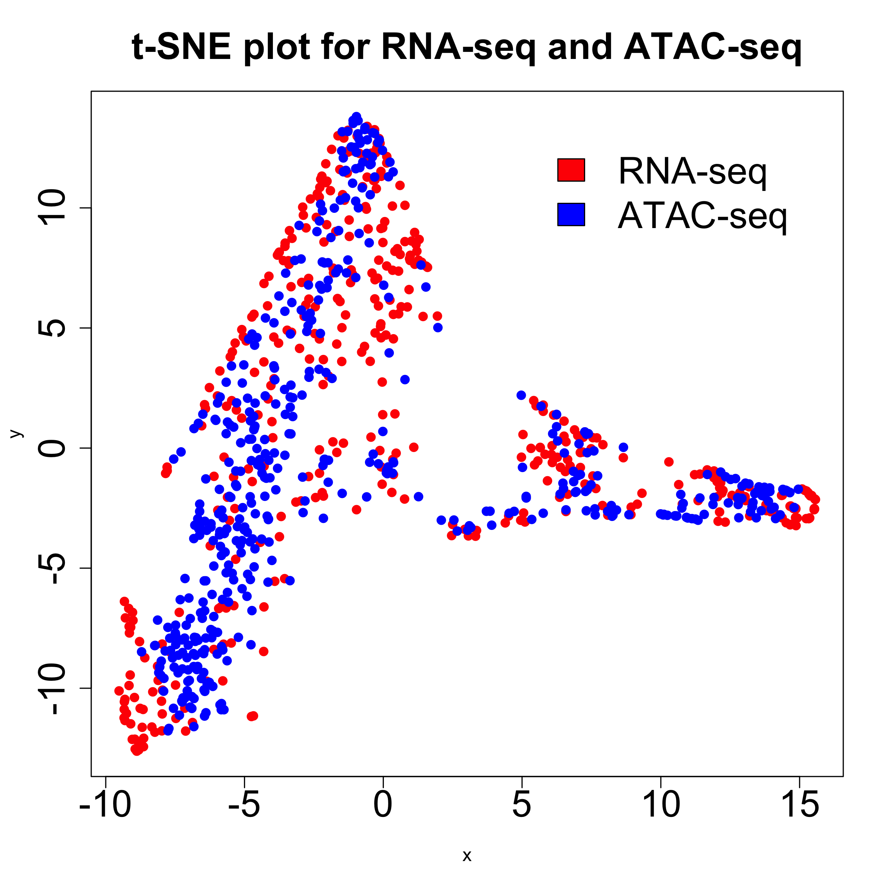

# scCompReg #
[](https://www.gnu.org/licenses/gpl-3.0)
[

scCompReg (**S**ingle-**C**ell **C**omparative **R**egulatory analysis) is an R package that provides coupled clustering and joint embedding of scRNA-seq and scATAC-seq on one sample, and performs comparative gene regulatory analysis between two conditions.

Please check the man page via `?function` (for example, `?sc_compreg`) for a detailed description of the types of inputs and outputs.

## System Requirements ##
* Operating System: Linux or MacOS
* R (>= 3.6.0)
* Bedtools (Linux)
* Homer (Linux)

## Change Log ##
### v1.0.0 ###
* scCompReg first release.

## Intallation
Use the following command to install scCompReg R package from source code:
```R
require(devtools)
devtools::install_github("SUwonglab/sc-compReg", ref="master", subdir="R_package")
```

## Example ##
For a full example of using the scCompReg method, please refer to `example.R`. The necessary data have been uploaded to the `data` folder in this repository.


To download the data, make sure you have `git lfs` installed. Installation instructions can be found here: https://github.com/git-lfs/git-lfs/wiki/Installation

Next, run the following line in shell:
```bash
git lfs clone https://github.com/SUwonglab/sc-compReg.git
```


The downloaded data directory will be in `sc-compReg/data/`. Simply set in R
```R
path = './example_data/'
prior_data_path = './prior_data/'
```
To run scCompReg, run the following lines in R:
```R
library(scCompReg)

sample1 = readRDS(paste(path, 'sample1.rds', sep = ''))
sample2 = readRDS(paste(path, 'sample2.rds', sep = ''))

peak.name.intersect.dir = paste(path, 'PeakName_intersect.txt', sep='')
peak.gene.prior.dir = paste(path, 'peak_gene_prior_intersect.bed', sep='')
motif = readRDS(paste(prior_data_path, 'motif_human.rds', sep=''))
motif.file = readRDS(paste(path, 'motif_file.rds', sep=''))

compreg.output = sc_compreg(sample1$O1,
                            sample1$E1,
                            sample1$O1.idx,
                            sample1$E1.idx,
                            sample1$symbol1,
                            sample1$peak.name1,
                            sample2$O2,
                            sample2$E2,
                            sample2$O2.idx,
                            sample2$E2.idx,
                            sample2$symbol2,
                            sample2$peak.name2,
                            motif$motif.name,
                            motif$motif.weight,
                            motif$match2,
                            motif.file,
                            peak.name.intersect.dir,
                            peak.gene.prior.dir,
                            sep.char=' ')

```
To save the obtained output, run the lines below in R:
```R
for (i in 1:compreg.output$n.pops) {
    write.table(compreg.output$hub.tf[[i]],
                paste(path, 'tf_', i, '.txt', sep=''),
                row.names = F,
                quote = F,
                sep = '\t')
    write.table(compreg.output$diff.net[[i]],
                paste(path, 'diff_net_', i, '.txt', sep=''),
                row.names = F,
                quote = F,
                sep = '\t')
}
```


## Full Workflow ##
The entire scCompReg workflow consists of three mandatory steps and one optional step. 

1. **Download the `prior_data` directory from github via `git clone git@github.com:SUwonglab/sc-compReg.git`.**

2. Optional: obtaining cluster assignments from coupled nonnegative matrix factorization.
    * Preproces data for `cnmf`:
        * Obtain `peak.bed` file
        * In `sc-compReg/preprocess_data/`, run the following script:

            ```bash
                bash cnmf_process_data.sh path/to/peak.bed genome_version path/to/prior_data
            ```
            where `genome_version` is one of {`hg19`, `hg38`, `mm9`, `mm10`}, and `prior_data` is a folder downloaded in step 1.
        * Output: 
            * peak_gene_coupling_matrix.txt
        * After loading `peak.name` and `symbol`, run the following script in R to convert `peak_gene_coupling_matrix.txt` to `D`, the coupling matrix, using the following code in R:
        ```R 
            D <- cnmf_load_coupling_matrix('peak_gene_coupling_matrix.txt'),
                                           peak.name,
                                           symbol)
        ```
        * `cnmf_tsne` allows users to visualize clustering outputs. Below are two example plots generated by `cnmf_tsne`:
            ```R
                cnmf_tsne(cnmf.output$H1, cnmf.output$H2, path=path, save.plot=F, perplexity=100)
            ```
            
            

    * Run `cnmf` to get the cluster labels for sample 1 and sample 2. The cluster labels should be passed to `sc_compreg` as `O1.idx`, `E1.idx`, `O2.idx`, and `E2.idx`. For an example on how to run `cnmf`, please refer to `cnmf_example.R`
    * Note: It is not required to obtain cluster assignments using the coupled nonnegative matrix factorization workflow. The necessary input to `scCompReg` is some consistent cluster assignments in scRNA-seq and scATAC-seq.

3. **Process data for `scCompReg`**
    * Obtain `peak_name1.txt` and `peak_name2.txt` files containing the peak names of sample 1 and sample 2, respectively in bed format (**chr** \t **start** \t **end**    but ignoring the spaces in the previous text) 
    * In `sc-compReg/preprocess_data/`, run the following script:

        ```bash
            bash sc_compreg_process_data_.sh path/to/peak_name1.txt path/to/peak_name2.txt genome_version path/to/prior_data
        ```
        where `genome_version` is one of {`hg19`, `hg38`, `mm9`, `mm10`}, and `prior_data` is a folder downloaded in step 1.
    * Output:
        * PeakName_intersect.txt
        * peak_gene_prior_intersect.bed
        * MotifTarget.txt

4. **Follow the tutorial on the `sc_compreg` function.**
    * **The necessary inputs to `sc_compreg` are**
        * consistent cluster assignments in scRNA-seq and scATAC-seq (can be obtained from coupled nonnegative matrix factorization or obtained elsewhere)
        * **log2-transformed** gene expression matrices of samples 1 and 2
        * **log2-transformed** chromatin accessibility matrices of samples 1 and 2
        * symbol names of samples 1 and 2
    * Input `peak.name.intersect.dir` is the path to the `PeakName_intersect.txt` file generated in step 3.
    * Input `peak.gene.prior.dir` is the path to the `peak_gene_prior_intersect.bed` file generated in step 3.
    * Load the corresponding motif file for human in R via
        ```R
            motif = readRDS('prior_data/motif_human.rds')
        ```
        or for mouse,
        ```R
            motif = readRDS('prior_data/motif_mouse.rds')
        ```
    * Load `motif.file` in R via
        ```R
            motif.file = mfbs_load(motif.target.dir)
        ```
        where `motif.target.dir` is the path to the `MotifTarget.txt` file generated in step 3.


## Usage ##
scCompReg provides access to the following functions:
Command       | Description
------------- | -------------
sc_compreg    | Performs single-cell comparative regulatory analysis based on scRNA-seq and scATAC-seq data from two different conditions.
mfbs_load     | Efficiently loads the `motif_target` file and returns an R `list` of the loaded objects.


## Citation ##
<a id="1">[1]</a> 
**Sc-compReg enables the comparison of gene regulatory networks between conditions using single-cell data**
Zhana Duren, Wenhui Sophia Lu, Joseph G. Arthur, Preyas Shah, Jingxue Xin,  Francesca Meschi, Miranda Lin Li, Corey M. Nemec, Yifeng Yin, and Wing Hung Wong
